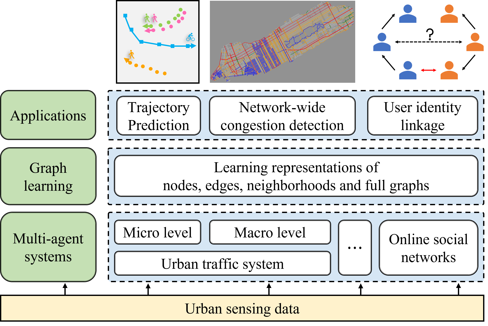

# Biography
I am currently a Lecturer in School of Computer Science and Cyber Engineering, Guangzhou University (GZHU). I received my Ph.D. degree from School of Computer Science and Engineering, Sun Yat-sen University (SYSU), advised by Prof. [Jiahai Wang](http://cse.sysu.edu.cn/content/2551). My Chinese hompage at GZHU is [here](http://jsj.gzhu.edu.cn/info/1208/3501.htm).

Email: chensiyuan AT gzhu.edu.cn
<!-- Email: chensy47 AT mail2.sysu.edu.cn -->

Office: 608, Electronic Information Laboratory Building

# Research Interests
I am broadly interested in graph learning. Recently, I am actively working on the following research topics:
- Graph learning for higher-order interactions: reveal the underlying higher-order structures (with a particular focus on simplicial complexes) of a dynamical system, and study how they affect the evolution of the system.
- Spatio-temporal generative models: develop deep generative models for complex spatio-temporal data.

During my Ph.D. study, I designed graph learning methods for multi-agent systems in the cyber, physical, and social space of smart cities, e.g., urban traffic systems and online social networks. For urban traffic systems, I tried to reveal how interactions of individuals at the microscopic level lead to the emergence of intelligence at the macroscopic level. For online social networks, I tried to link accounts belonging to the same person across different social networks, a.k.a. user identity linkage, so that user information can be integrated for more comprehensive urban sensing and computing. My past research is summarized in the following figure.

# Work Experience
- 2023.7 - Present: Lecturer in School of Computer Science and Cyber Engineering, Guangzhou University.

# Education
- Ph.D.  in Computer Science and Technology, Sun Yat-sen University, 2018.9 - 2023.6.
- B.S. in Mathematics and Applied Mathematics, Sun Yat-sen University, 2014.9 - 2018.6.

# Fundings
- 国家自然科学基金青年基金, 多智能体高阶交互图学习方法与应用研究, 2025.1-2027.12, 主持

# Research Experience
- 2019.12 - 2022.12: Crowd Intelligence Emergence Mechanism and Evolution Method.

# Internship
- 2021.4 - 2021.5: iFLYTEK Co., Ltd., Hefei, China.

# Teaching
- GZHU: Computer and Information Technology Foundations (2024 Spring & Fall)
- GZHU: Data Mining (2023 Fall, Graduate-level)
- SYSU DCS314: Intelligent Algorithms With Applications, TA (2021 Spring)
- SYSU DCS5601: Modern Artificial Intelligence Technology, TA (2020 Fall)
- SYSU DCS2691: Algebraic Structure, TA (2019 Fall)

# Academic Service
Conference Reviewer: NeurIPS 2024/2023, ICML 2024, ICLR 2025/2024, AAAI 2024/2021, DASFAA 2024, ECAI 2024, ECML-PKDD 2021

Workshop Reviewer: Temporal Graph Learning Workshop @ NeurIPS 2023

Journal Reviewer: T-ITS 2024, IEEE Network Magazine 2022

Conference Volunteer: PRCV 2019

# Misc
I maintain a technical blog in Chinese [here](https://www.cnblogs.com/hilbert9221/).